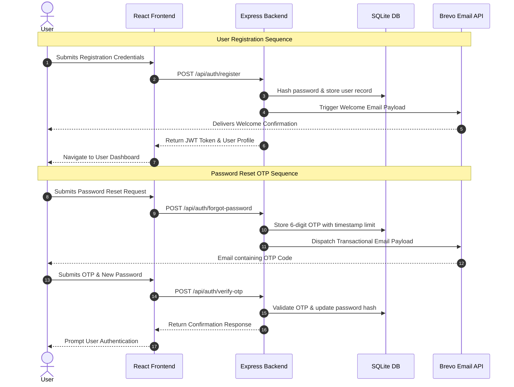
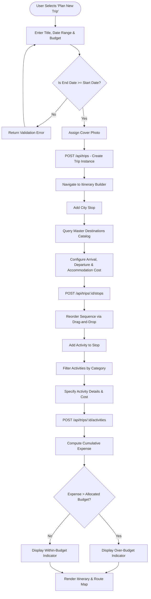
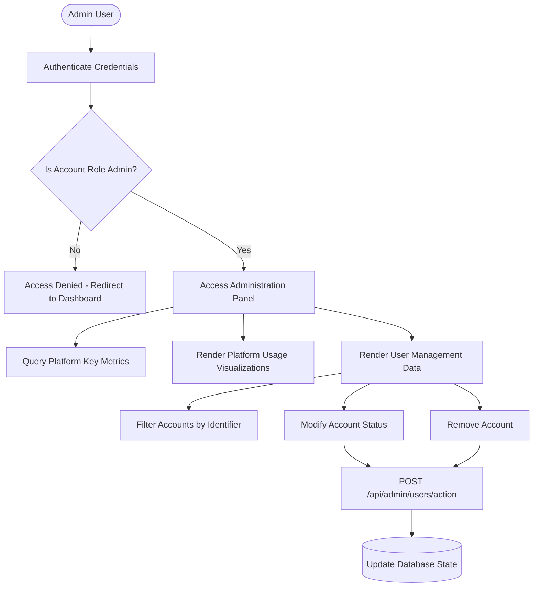

# GlobeTrotter - Process Flowcharts & Architectural Diagrams

This document outlines the system architecture, sequence workflows, and data processing logic for the GlobeTrotter travel planning platform.

---

## 1. Overall System Architecture & Data Flow

---

## 2. Authentication & Transactional Email Workflow

---

## 3. Multi-City Trip Construction Workflow

---

## 4. Public Itinerary Sharing & Duplication Flow

```mermaid
flowchart LR
    Owner[Trip Owner] -->|Selects Share Option| GenerateSlug[Generate Unique Identifier]
    GenerateSlug --> UpdateDB[Update Record Public Status]
    UpdateDB --> CopyLink[Generate Public Link]
    
    CopyLink -->|Distribution| Visitor[External User]
    Visitor --> OpenURL[Access Public Route]
    OpenURL --> PublicView[Render Read-Only Itinerary]
    
    PublicView --> ForkBtn[Select Clone Itinerary Option]
    ForkBtn --> CheckAuth{Is Visitor Authenticated?}
    CheckAuth -- No --> RedirectLogin[Redirect to Login Route]
    CheckAuth -- Yes --> API_Fork[POST /api/trips/:id/duplicate]
    
    API_Fork --> CloneTrip[Duplicate Trip, Stops & Activities]
    CloneTrip --> SuccessToast[Display Confirmation]
    SuccessToast --> MyTrips[Redirect to User Trip Collection]
```

---

## 5. Administrative Analytics & Account Management Flow

