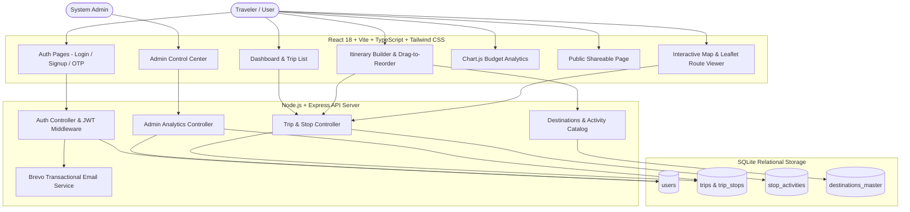
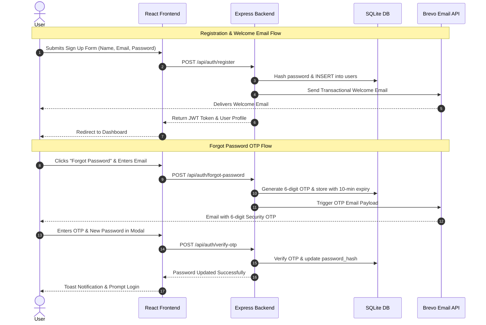
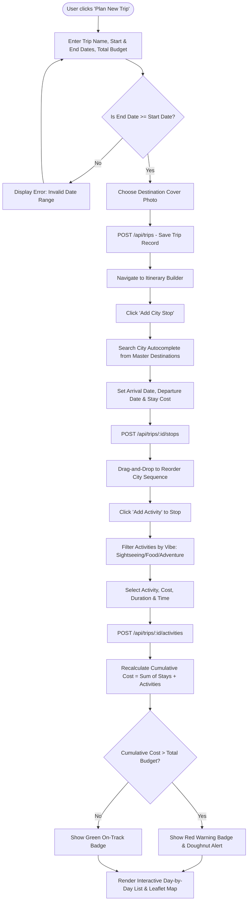
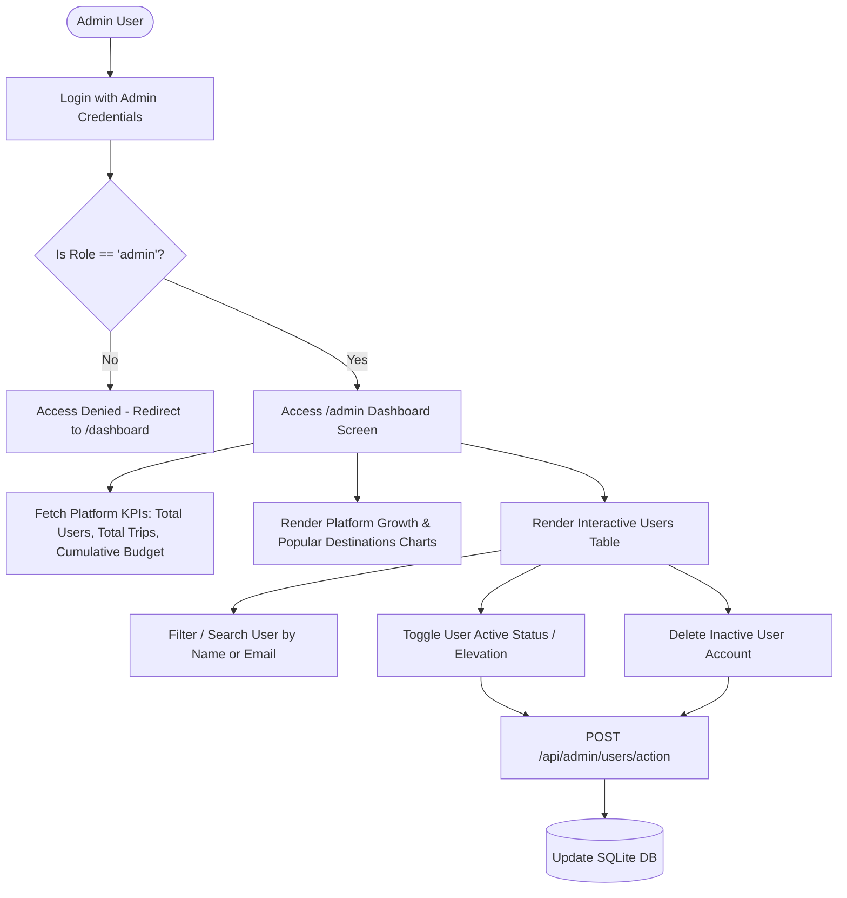

# GlobeTrotter - Comprehensive Process Flowcharts & Architecture Maps

This document contains detailed visual flowcharts for all core processes in the GlobeTrotter travel planning application.

---

## 1. Overall System Architecture & Data Flow

---

## 2. Authentication & Brevo Transactional Email OTP Flow

---

## 3. Multi-City Trip Creation & Itinerary Building Flow

---

## 4. Public Trip Sharing & Forking Flow

```mermaid
flowchart LR
    Owner[Trip Owner] -->|Clicks 'Share Trip'| GenerateSlug[Generate Unique Share Slug]
    GenerateSlug --> UpdateDB[SET is_public = true, share_slug = uuid]
    UpdateDB --> CopyLink[Copy URL: /share/:slug]
    
    CopyLink -->|Share via WhatsApp/Twitter/Direct| Friend[Friend / Visitor]
    Friend --> OpenURL[Access /share/:slug in Browser]
    OpenURL --> PublicView[Render Read-Only Public Itinerary Screen]
    
    PublicView --> ForkBtn[Click 'Fork / Copy Trip to My Account']
    ForkBtn --> CheckAuth{Is Visitor Logged In?}
    CheckAuth -- No --> RedirectLogin[Redirect to /login with Return URL]
    CheckAuth -- Yes --> API_Fork[POST /api/trips/:id/duplicate]
    
    API_Fork --> CloneTrip[Deep Clone Trip, Stops & Activities in SQLite]
    CloneTrip --> SuccessToast[Toast: 'Trip duplicated to your account!']
    SuccessToast --> MyTrips[Redirect to My Trips Screen]
```

---

## 5. Admin Analytics & User Control Flow

