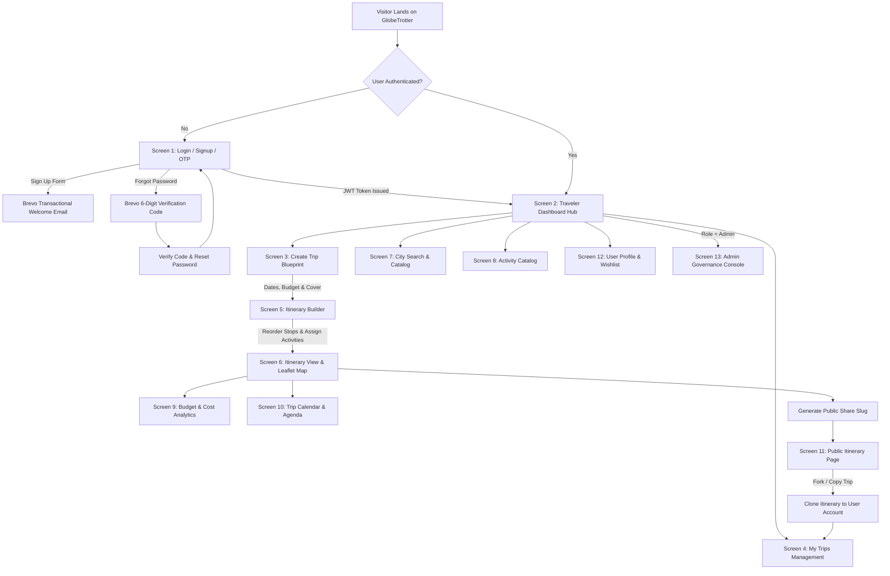
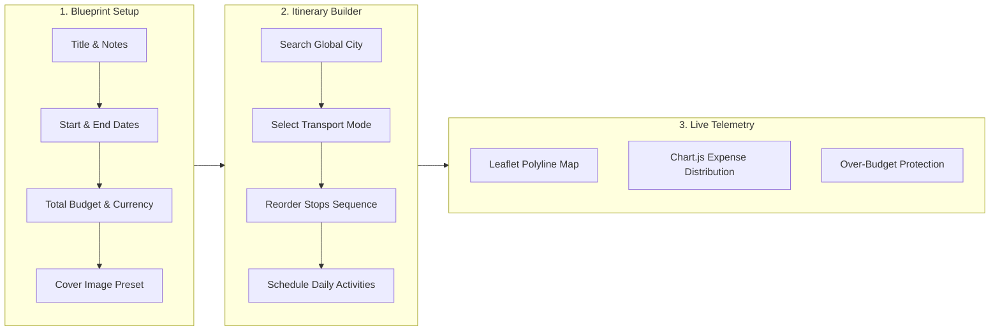
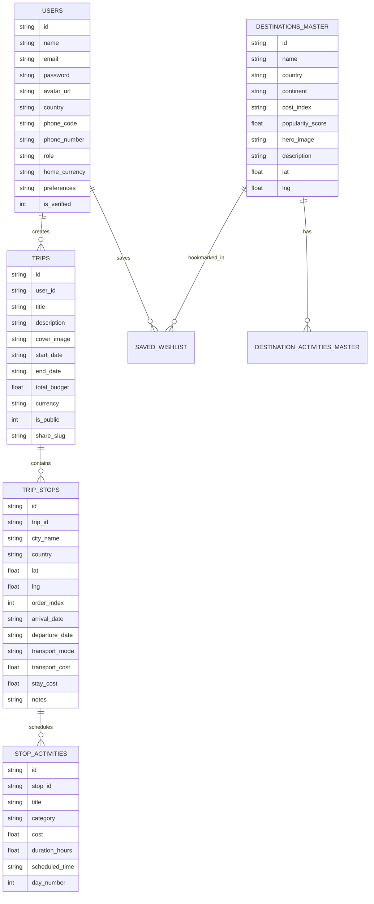
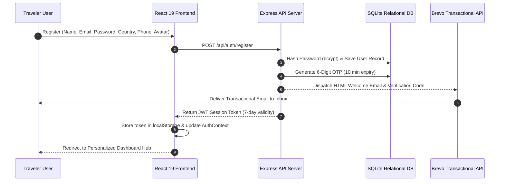

<div align="center">

# GlobeTrotter - Intelligent Multi-City Travel Planning Platform

### Official Submission for the Odoo Hackathon 2026

*A production-grade, full-stack travel platform featuring a custom Node.js Express backend, relational SQLite database architecture with foreign keys and cascading integrity, interactive Leaflet route mapping, Chart.js real-time financial telemetry, day-by-day itinerary timeline scheduling, Brevo transactional verification emails, and collaborative public sharing.*

---

[](https://reactjs.org/)
[](https://www.typescriptlang.org/)
[](https://vitejs.dev/)
[](https://tailwindcss.com/)
[](https://nodejs.org/)
[](https://expressjs.com/)
[](https://www.sqlite.org/)
[](https://leafletjs.com/)
[](https://www.chartjs.org/)
[](https://www.brevo.com/)

</div>

---

## Table of Contents
1. [Hackathon Problem Statement & Requirements Alignment](#1-hackathon-problem-statement--requirements-alignment)
2. [End-to-End System Architecture & User Flowcharts](#2-end-to-end-system-architecture--user-flowcharts)
3. [13 Complete Application Screens Matrix](#3-13-complete-application-screens-matrix)
4. [Relational Database Design & Schema Specification](#4-relational-database-design--schema-specification)
5. [Authentication & Transactional Email Security Flow](#5-authentication--transactional-email-security-flow)
6. [Demo Accounts & Evaluation Credentials](#6-demo-accounts--evaluation-credentials)
7. [Repository Structure & Clean Architecture](#7-repository-structure--clean-architecture)
8. [Installation & Startup Guide](#8-installation--startup-guide)
9. [REST API Endpoints Specification](#9-rest-api-endpoints-specification)

---

## 1. Hackathon Problem Statement & Requirements Alignment

| Core Hackathon Requirement | GlobeTrotter Implementation | Code Verification Link |
|---|---|---|
| **Multi-City Itinerary Planning** | Dynamic multi-destination planner with sequential stop reordering, dates allocation, transport modes (flight, train, bus, car), and activities. | [`ItineraryBuilder.tsx`](frontend/src/pages/ItineraryBuilder.tsx) |
| **Relational Database Design** | 8 interrelated SQL tables with strict Foreign Key constraints, `ON DELETE CASCADE`, composite keys, and performance indexing. | [`schema.sql`](backend/schema.sql) & [`db.js`](backend/src/config/db.js) |
| **Interactive Route Visualizer** | Multi-stop Leaflet map connecting destination coordinates with flight arcs, numbered pins, and popup activity summaries. | [`MapView.tsx`](frontend/src/components/MapView.tsx) |
| **Real-Time Budget Analytics** | Real-time expense breakdown with Chart.js Doughnut (categories) and Bar (stops) charts + over-budget alert banner. | [`BudgetBreakdown.tsx`](frontend/src/pages/BudgetBreakdown.tsx) |
| **User Authentication & OTP** | Custom JWT auth + password hashing + Brevo transactional HTML email verification codes (10 min expiry). | [`authController.js`](backend/src/controllers/authController.js) |
| **Public Itinerary Sharing** | Unique shareable slugs (`/share/:slug`) with read-only view and 1-click "Fork / Copy to My Trips" cloning. | [`SharedItinerary.tsx`](frontend/src/pages/SharedItinerary.tsx) |
| **Admin Governance Console** | Dedicated dashboard with platform KPIs, top destinations ranking, category spending metrics, and user management. | [`AdminDashboard.tsx`](frontend/src/pages/AdminDashboard.tsx) |

---

## 2. End-to-End System Architecture & User Flowcharts

### Platform Navigation and User Journey


---

### Multi-City Trip Builder Pipeline


---

## 3. 13 Complete Application Screens Matrix

| # | Screen Name | Route Path | Core Capabilities & UI Highlights |
|---|---|---|---|
| **1** | **Login / Signup / OTP** | `/login` | Cartoon avatar selector (DiceBear vectors), country auto-dial code binding (+91, +1, +44), password strength meter, 6-digit OTP code input, custom JWT session tokens. |
| **2** | **Dashboard / Home** | `/dashboard` | Traveler greeting, KPI telemetry cards (Trips, Destinations, Budget), "Plan New Trip" CTA, recent itineraries stream, and trending global destinations carousel. |
| **3** | **Create Trip** | `/create-trip` | Step-by-step trip blueprint form: Title, start & end date picker with auto-calculated duration, budget input, currency selector, high-res cover photo presets, and live preview card. |
| **4** | **My Trips (List View)** | `/my-trips` | Filter tabs (All, Upcoming, Ongoing, Completed), search bar, Grid/List view toggle, summary cards with budget progress meters, actions (View, Edit, Duplicate, Share, Delete). |
| **5** | **Itinerary Builder** | `/itinerary/:id/builder` | Multi-city builder: "Add Stop" modal with city search autocomplete, date allocation per stop, drag/move up-down city reordering, transport mode selector (flight, train, bus, car), and activity assigner. |
| **6** | **Itinerary View** | `/itinerary/:id` | Day-wise breakdown, city headers, activity blocks with time/cost/category badges, dual view toggle (Interactive Timeline vs Leaflet Route Map), and Print/PDF export. |
| **7** | **City Search & Explore** | `/explore-cities` | Global destination directory: Filter by continent (Europe, Asia, Americas, Africa, Oceania), cost index ($, $$, $$$, $$$$), popularity rating, and direct "Add to Trip" modal. |
| **8** | **Activity Search & Catalog** | `/activities` | Experiences directory by category (Sightseeing, Food, Adventure, Culture, Nightlife, Relax), max price filter, and modal preview with instant "Add to Stop" scheduling. |
| **9** | **Trip Budget & Cost Breakdown** | `/itinerary/:id/budget` | Financial dashboard: Budget vs Total Cost, interactive Doughnut Chart (Transport, Accommodation, Activities, Food, Misc) and daily spending Bar Chart, currency switcher, and over-budget alert banners. |
| **10** | **Trip Calendar & Timeline** | `/itinerary/:id/calendar` | Interactive calendar view with day ribbons, expandable day views, and sequential activity timeline showing scheduled start times and durations. |
| **11** | **Shared / Public Itinerary** | `/share/:slug` | Read-only presentation page accessible via public URL/slug, interactive route map, summary stats, "Copy Trip to My Account" feature, and one-click social share buttons (WhatsApp, Twitter/X, Copy Link). |
| **12** | **User Profile & Settings** | `/profile` | Editable user details (name, avatar, bio, home country, phone number, currency), travel style tags, saved wishlist destinations, and danger-zone account deletion. |
| **13** | **Admin / Analytics Dashboard** | `/admin` | Admin control center: Platform KPIs (Total Users, Trips Created, Total Budget), top destination rankings, category expenditure stats, and user governance table with role toggles. |

---

## 4. Relational Database Design & Schema Specification

The complete SQL Data Definition Language (DDL) is located in **[`backend/schema.sql`](backend/schema.sql)** and initialized programmatically in **[`backend/src/config/db.js`](backend/src/config/db.js)**.



### Relational Database Table Architecture

| Table Name | Primary Key | Foreign Keys & Cascades | Purpose & Business Logic |
|---|---|---|---|
| `users` | `id` (TEXT) | None | Core traveler and admin identity records, bcrypt password hashes, and regional configuration. |
| `email_verifications` | `id` (TEXT) | None | 6-digit OTP verification token ledger with 10-minute validity timestamps. |
| `trips` | `id` (TEXT) | `user_id` $\rightarrow$ `users(id)` `ON DELETE CASCADE` | Multi-city itinerary blueprint with total budget, currency, and public share slug. |
| `trip_stops` | `id` (TEXT) | `trip_id` $\rightarrow$ `trips(id)` `ON DELETE CASCADE` | Sequential destination stops with lat/lng coordinates, arrival/departure dates, and transit mode. |
| `stop_activities` | `id` (TEXT) | `stop_id` $\rightarrow$ `trip_stops(id)` `ON DELETE CASCADE` | Granular scheduled items allocated to a stop with start time, duration, and individual cost. |
| `destinations_master`| `id` (TEXT) | None | Curated catalog of global cities with continent, cost tier ($-$$$$), and popularity rating. |
| `destination_activities_master` | `id` (TEXT) | `destination_id` $\rightarrow$ `destinations_master(id)` `ON DELETE CASCADE` | Pre-built activity catalog for instant 1-click addition to traveler itineraries. |
| `saved_wishlist` | `id` (TEXT) | `user_id` $\rightarrow$ `users(id)`, `destination_id` $\rightarrow$ `destinations_master(id)` | Composite relation `UNIQUE(user_id, destination_id)` for bookmarked destinations. |

---

## 5. Authentication & Transactional Email Security Flow



---

## 6. Demo Accounts & Evaluation Credentials

| Role | Email | Password | Access Scope |
|---|---|---|---|
| **Traveler (Default)** | `traveler.user@example.com` | `Traveler@123` | Multi-city itineraries, budget analytics, calendar scheduling, wishlist bookmarks |
| **Administrator** | `admin@globetrotter.com` | `Admin@123` | Platform KPI telemetry, category expenditure charts, user governance directory |

---

## 7. Repository Structure & Clean Architecture

```
GlobeTrotter/
├── backend/
│   ├── globetrotter.db             # Relational SQLite database
│   ├── schema.sql                  # Pure SQL DDL schema & table design for judges
│   ├── src/
│   │   ├── config/
│   │   │   └── db.js               # Database connection & table initializers
│   │   ├── controllers/
│   │   │   ├── adminController.js  # Platform telemetry & user governance
│   │   │   ├── authController.js   # JWT auth, registration, OTP verification
│   │   │   ├── destinationsController.js # Cities & activity master catalog
│   │   │   └── tripController.js   # Multi-city itinerary CRUD & cascading logic
│   │   ├── middleware/
│   │   │   └── authMiddleware.js   # JWT token verification & role authorization
│   │   ├── seed/
│   │   │   ├── seed.js             # Automated database seeder
│   │   │   └── seedData.js         # 15 global cities, 50+ curated activities
│   │   ├── services/
│   │   │   └── brevoService.js     # Brevo REST API email dispatcher & templates
│   │   └── server.js               # Express application entrypoint
│   └── package.json
│
├── frontend/
│   ├── src/
│   │   ├── components/
│   │   │   ├── ActivityCard.tsx    # Curated activity card with add modal
│   │   │   ├── BudgetCharts.tsx    # Chart.js Doughnut & Stacked Bar visualizers
│   │   │   ├── CityCard.tsx        # Destination card with wishlist toggle
│   │   │   ├── Footer.tsx          # Responsive footer without emojis
│   │   │   ├── LoadingScreen.tsx   # Full-screen animated compass loader
│   │   │   ├── Logo.tsx            # Modern multi-ring vector brand logo
│   │   │   ├── MapView.tsx         # Interactive Leaflet polyline route map
│   │   │   ├── Navbar.tsx          # Glassmorphic navigation header
│   │   │   └── TripCard.tsx        # Multi-city trip card with progress meters
│   │   ├── context/
│   │   │   ├── AuthContext.tsx     # Custom JWT authentication context
│   │   │   ├── ThemeContext.tsx    # Dark / Light theme state manager
│   │   │   └── ToastContext.tsx    # Modern toast notification provider
│   │   ├── pages/                  # 13 Application screens
│   │   ├── services/
│   │   │   └── api.ts              # Type-safe Axios API client
│   │   ├── types/
│   │   │   └── index.ts            # TypeScript interfaces & domain models
│   │   └── utils/
│   │       └── countries.ts        # Country code & dial code mapping
│   ├── index.html
│   ├── tailwind.config.js
│   ├── vite.config.ts
│   └── package.json
└── README.md
```

---

## 8. Installation & Startup Guide

### Prerequisites
- Node.js (v18 or higher)
- npm (v9 or higher)

### 1. Clone the Repository
```bash
git clone https://github.com/Nirjala7-11/GlobeTrotter.git
cd GlobeTrotter
```

### 2. Launch Backend API Server
```bash
cd backend
npm install
node src/seed/seed.js   # Seeds 15 global cities, 50+ master activities, & demo trips
npm start               # Runs Express backend on http://localhost:5000
```

### 3. Launch Frontend Application
In a second terminal:
```bash
cd frontend
npm install
npm run dev             # Runs Vite dev server on http://localhost:5173
```

Open your browser at: **`http://localhost:5173`**

---

## 9. REST API Endpoints Specification

| Method | Endpoint | Description | Auth Required |
|---|---|---|---|
| `POST` | `/api/auth/register` | Register new user with country, phone, cartoon avatar and trigger Brevo emails | No |
| `POST` | `/api/auth/login` | Authenticate user and receive JWT session token | No |
| `POST` | `/api/auth/forgot-password`| Request 6-digit verification code | No |
| `POST` | `/api/auth/reset-password` | Reset password using verified 6-digit code | No |
| `GET` | `/api/auth/profile` | Get current authenticated user profile and stats | Yes (Bearer) |
| `PUT` | `/api/auth/profile` | Update profile, bio, country, phone, preferences | Yes (Bearer) |
| `GET` | `/api/trips` | Get all user trips with computed stops and costs | Yes (Bearer) |
| `POST` | `/api/trips` | Create new multi-city trip blueprint | Yes (Bearer) |
| `GET` | `/api/trips/:id` | Get full trip detail with ordered stops and activities | Yes (Bearer) |
| `POST` | `/api/trips/:id/stops` | Add a destination stop to trip | Yes (Bearer) |
| `PUT` | `/api/trips/:id/stops/reorder` | Reorder stops sequence | Yes (Bearer) |
| `POST` | `/api/stops/:stopId/activities` | Schedule an activity on a stop | Yes (Bearer) |
| `POST` | `/api/trips/:id/duplicate` | Duplicate / fork an existing trip | Yes (Bearer) |
| `GET` | `/api/trips/share/:slug` | Public read-only trip view by slug | No |
| `GET` | `/api/destinations` | Explore global destination catalog with filters | No |
| `POST` | `/api/wishlist/toggle` | Bookmark/unbookmark destination | Yes (Bearer) |
| `GET` | `/api/admin/analytics` | Admin KPI telemetry and category metrics | Yes (Admin) |
| `GET` | `/api/admin/users` | Admin user directory and role management | Yes (Admin) |

---

## License & Attribution
Designed and developed for the **Odoo Hackathon 2026**. Licensed under the [MIT License](LICENSE).
