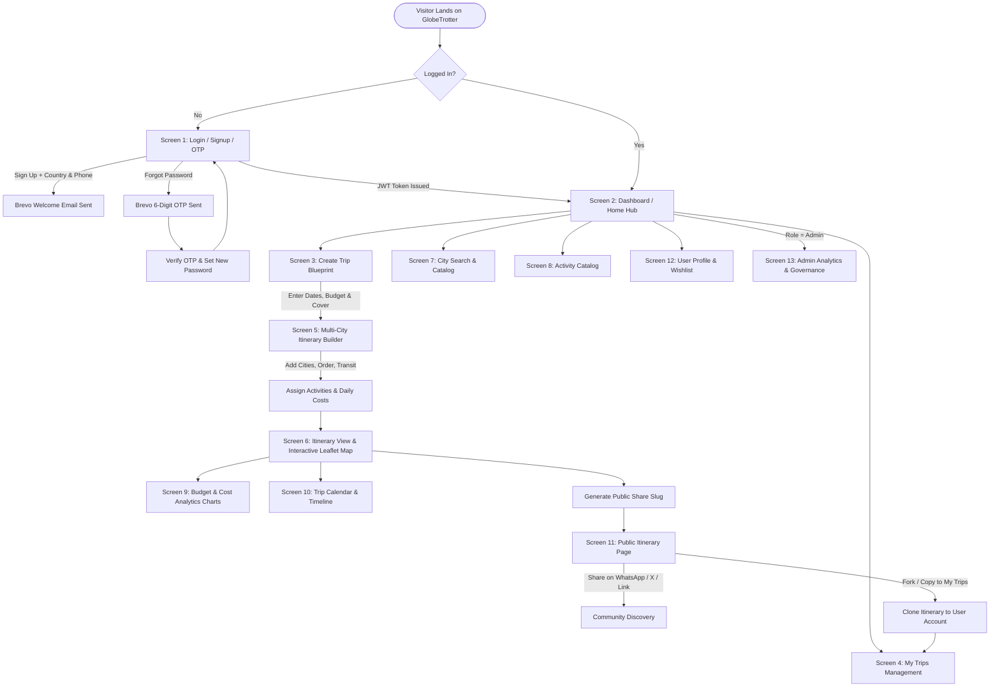
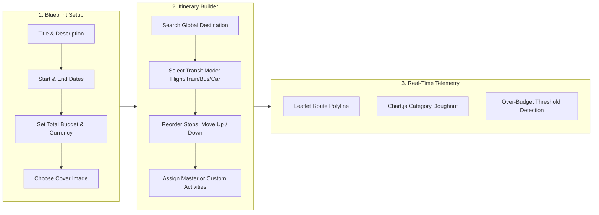
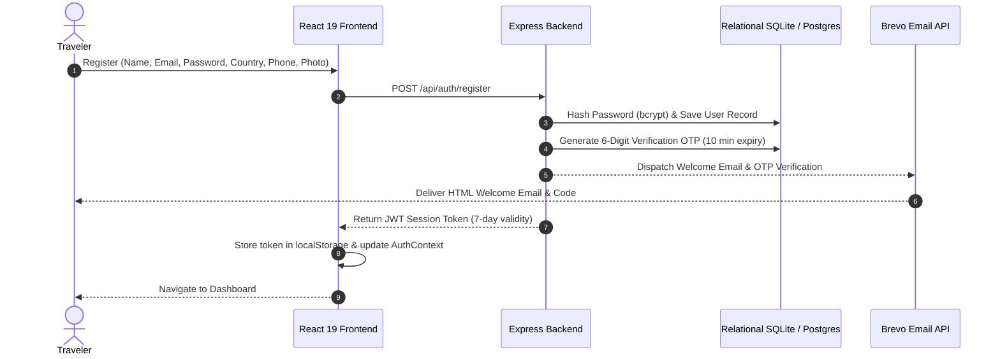
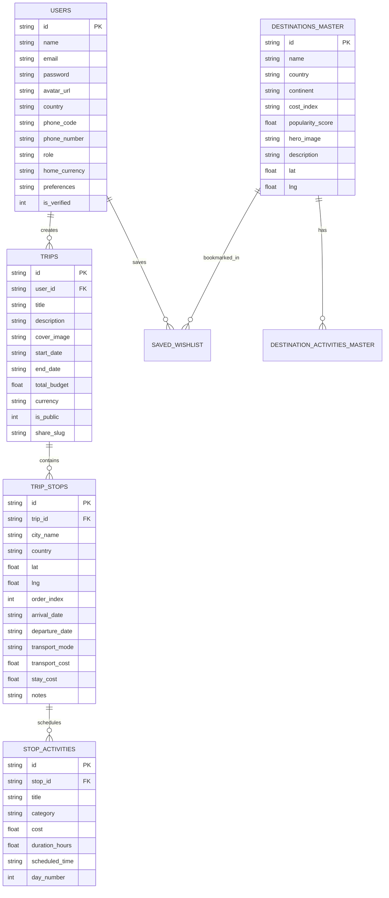

<div align="center">

# GlobeTrotter - Personalized Multi-City Travel Planning Platform

### Built for the Odoo Hackathon 2026

*An intelligent, full-stack multi-city travel planning platform featuring interactive Leaflet route mapping, real-time Chart.js budget forecasting, day-by-day scheduling, Supabase Cloud / Relational database architecture, Brevo transactional email OTP, and public collaborative itinerary sharing.*

---

[](https://reactjs.org/)
[](https://www.typescriptlang.org/)
[](https://vitejs.dev/)
[](https://tailwindcss.com/)
[](https://leafletjs.com/)
[](https://www.chartjs.org/)
[](https://supabase.com/)
[](https://www.brevo.com/)
[](https://www.sqlite.org/)

</div>

---

## Table of Contents
1. [Core Features and Capabilities](#core-features-and-capabilities)
2. [Complete End-to-End System and User Flowcharts](#complete-end-to-end-system-and-user-flowcharts)
3. [13 Screens Feature Matrix](#13-screens-feature-matrix)
4. [Hybrid Authentication and Brevo Email Flow](#hybrid-authentication-and-brevo-email-flow)
5. [Relational Database and Entity Relationship Model](#relational-database-and-entity-relationship-model)
6. [Demo Accounts](#demo-accounts)
7. [Supabase Setup](#supabase-setup)
8. [Installation and Startup Guide](#installation-and-startup-guide)
9. [REST API Endpoints Specification](#rest-api-endpoints-specification)

---

## Core Features and Capabilities

- **Modern Glassmorphic UI**: Designed with Tailwind CSS, Lucide travel icons, dark/light theme switching, responsive grid layouts, and micro-interactions powered by Framer Motion and Canvas Confetti.
- **Interactive Leaflet Route Maps**: Connected multi-city polyline routes with flight arcs, custom numbered map markers, stop-order pins, and popup activity summaries.
- **Real-Time Financial Analytics**: Interactive Chart.js Doughnut (Expense Categories) and Stacked Bar (City-by-City Cost Distribution) charts with live over-budget alert banners.
- **Smart Country and Phone Code Auto-Binding**: Real-time country selector (India, United States, United Kingdom, France, Japan, United Arab Emirates, etc.) that automatically sets the matching international dial code (+91, +1, +44, etc.) and default home currency.
- **Profile Photo Customizer**: Curated avatar presets with selection states plus custom photo URL input.
- **Dual-Backend Architecture**: Works out-of-the-box with a zero-dependency Relational SQLite Backend and provides instant cloud sync with Supabase PostgreSQL (`supabase/schema.sql`).
- **Brevo Transactional Emails**: Dispatches 6-digit OTP verification codes and HTML welcome onboarding emails, featuring a development simulation fallback for judging.
- **Public Share and 1-Click Fork**: Shareable public URLs that allow fellow travelers to view, copy, or fork any itinerary into their personal account.
- **Admin and Analytics Governance**: Dedicated administrator control panel with platform KPIs, top destination visit metrics, category spending distributions, and user management.

---

## Complete End-to-End System and User Flowcharts

### 1. Platform Navigation and User Journey Flow


---

### 2. Multi-City Trip Builder and Route Execution Pipeline


---

## 13 Screens Feature Matrix

| # | Screen Name | Route Path | Core Capabilities and Layout Polish |
|---|---|---|---|
| **1** | **Login / Signup / OTP** | `/login` | Split-screen travel artwork, profile photo picker (presets + URL), country selector with auto-dial code (+91, +1, +44), password strength meter, JWT + Supabase + Brevo OTP email flow, and 1-click demo login buttons. |
| **2** | **Dashboard / Home** | `/dashboard` | Personalized traveler greeting with user avatar, quick KPI cards (Trips, Destinations, Budget), prominent "Plan New Trip" hero CTA, recent trips stream, and trending global destinations carousel. |
| **3** | **Create Trip** | `/create-trip` | Step-by-step trip blueprint form: Title, start & end date picker with auto-calculated duration, budget input, currency selector, curated high-res cover photos, and live preview card. |
| **4** | **My Trips (List View)** | `/my-trips` | Filter tabs (All, Upcoming, Ongoing, Completed), search bar, Grid/List view toggle, summary cards with budget progress meters, actions (View, Edit, Duplicate, Share, Delete). |
| **5** | **Itinerary Builder** | `/itinerary/:id/builder` | Interactive multi-city builder: "Add Stop" modal with city search autocomplete, date allocation per stop, drag/move up-down city reordering, transport mode selector (flight, train, bus, car), and activity assigner. |
| **6** | **Itinerary View** | `/itinerary/:id` | Comprehensive itinerary visualizer: Day-wise breakdown, city headers, activity blocks with time/cost/category badges, and dual view toggle (Interactive Timeline vs Route Map), plus Print/PDF export. |
| **7** | **City Search & Explore** | `/explore-cities` | Global destination discovery directory: Filter by continent/region (Europe, Asia, Americas, Africa, Oceania), cost index ($, $$, $$$, $$$$), popularity rating, and direct "Add to Trip" action modal. |
| **8** | **Activity Search & Catalog** | `/activities` | Browse experiences by category (Sightseeing, Food & Dining, Adventure, Culture, Nightlife, Relaxation), max price filter, and modal preview with instant "Add to Stop" scheduling. |
| **9** | **Trip Budget & Cost Breakdown** | `/itinerary/:id/budget` | Financial dashboard: Budget vs Total Cost, interactive Doughnut Chart (Transport, Accommodation, Activities, Food, Misc) and daily spending Bar Chart, currency switcher, and over-budget alert banners. |
| **10** | **Trip Calendar & Timeline** | `/itinerary/:id/calendar` | Interactive calendar view with day ribbons, expandable day views, and sequential activity timeline showing scheduled start times and durations. |
| **11** | **Shared / Public Itinerary** | `/share/:slug` | Clean read-only presentation page accessible via public URL/slug, interactive route map, summary stats, "Copy Trip to My Account" feature, and one-click social share buttons (WhatsApp, Twitter/X, Copy Link). |
| **12** | **User Profile & Settings** | `/profile` | Editable user details (name, avatar, bio, home country, phone number, currency), travel style tags (Solo, Luxury, Backpacking, Foodie, Nature), saved wishlist destinations, and danger-zone account deletion. |
| **13** | **Admin / Analytics Dashboard** | `/admin` | Admin-only control center: Platform KPIs (Total Users, Trips Created, Total Budget), top destination visit rankings, category expenditure stats, and user governance table with role toggles. |

---

## Hybrid Authentication and Brevo Email Flow



---

## Relational Database and Entity Relationship Model



---

## Demo Accounts

| Role | Email | Password | Access / Scope |
|---|---|---|---|
| **Traveler (Default)** | `traveler.user@example.com` | `Traveler@123` | Multi-city itineraries, budget analytics, calendar scheduling, wishlist bookmarks |
| **Administrator** | `admin@globetrotter.com` | `Admin@123` | Platform KPI telemetry, category expenditure charts, user governance directory |

> **Tip**: On the Login screen (`/login`), click the **"Traveler User"** or **"Admin"** 1-click buttons to instantly populate credentials.

---

## Supabase Setup

GlobeTrotter provides complete PostgreSQL integration for Supabase Cloud:
1. Create a free project at [supabase.com](https://supabase.com/).
2. Open the **SQL Editor** and paste the contents of **`supabase/schema.sql`** (creates all tables, Row-Level Security policies, and sync triggers).
3. In `frontend/.env`:
   ```env
   VITE_SUPABASE_URL=https://your-project.supabase.co
   VITE_SUPABASE_ANON_KEY=your-supabase-anon-key
   ```
4. The client will automatically activate Supabase Auth and Cloud database synchronization.

---

## Installation and Startup Guide

### Prerequisites
- Node.js (v18 or higher)
- npm (v9 or higher)

### 1. Clone the Repository
```bash
git clone https://github.com/Nirjala7-11/GlobeTrotter.git
cd GlobeTrotter
```

### 2. Launch Backend API Server
```bash
cd backend
npm install
node src/seed/seed.js   # Seeds 15 global cities, 50+ master activities, & demo trips
npm start               # Runs Express backend on http://localhost:5000
```

### 3. Launch Frontend Application
In a second terminal:
```bash
cd frontend
npm install
npm run dev             # Runs Vite dev server on http://localhost:5173
```

Open your browser at: **`http://localhost:5173`**

---

## REST API Endpoints Specification

| Method | Endpoint | Description | Auth Required |
|---|---|---|---|
| `POST` | `/api/auth/register` | Register new user with country, phone, avatar and trigger Brevo emails | No |
| `POST` | `/api/auth/login` | Authenticate user and receive JWT token | No |
| `POST` | `/api/auth/forgot-password`| Request 6-digit Brevo OTP verification code | No |
| `POST` | `/api/auth/reset-password` | Reset password using verified OTP | No |
| `GET` | `/api/auth/profile` | Get current authenticated user profile and stats | Yes (Bearer) |
| `PUT` | `/api/auth/profile` | Update profile, bio, country, phone, preferences | Yes (Bearer) |
| `GET` | `/api/trips` | Get all user trips with computed stops and costs | Yes (Bearer) |
| `POST` | `/api/trips` | Create new multi-city trip blueprint | Yes (Bearer) |
| `GET` | `/api/trips/:id` | Get full trip detail with ordered stops and activities | Yes (Bearer) |
| `POST` | `/api/trips/:id/stops` | Add a destination stop to trip | Yes (Bearer) |
| `PUT` | `/api/trips/:id/stops/reorder` | Reorder stops sequence | Yes (Bearer) |
| `POST` | `/api/stops/:stopId/activities` | Schedule an activity on a stop | Yes (Bearer) |
| `POST` | `/api/trips/:id/duplicate` | Duplicate / fork an existing trip | Yes (Bearer) |
| `GET` | `/api/trips/share/:slug` | Public read-only trip view by slug | No |
| `GET` | `/api/destinations` | Explore global destination catalog with filters | No |
| `POST` | `/api/wishlist/toggle` | Bookmark/unbookmark destination | Yes (Bearer) |
| `GET` | `/api/admin/analytics` | Admin KPI telemetry and category metrics | Yes (Admin) |
| `GET` | `/api/admin/users` | Admin user directory and role management | Yes (Admin) |

---

## License and Attribution
Designed and developed for the **Odoo Hackathon 2026**. Licensed under the [MIT License](LICENSE).
