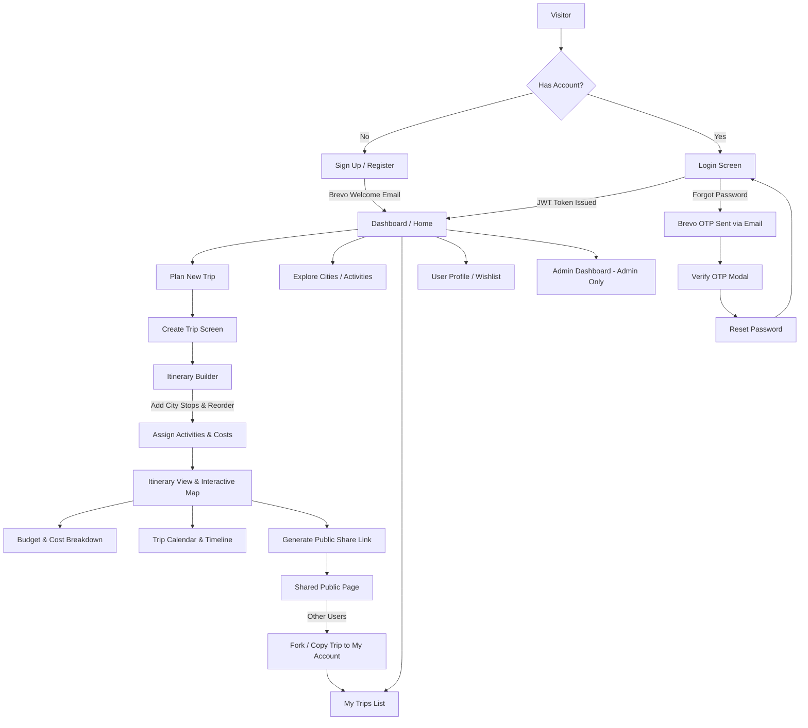
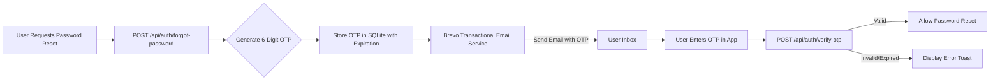
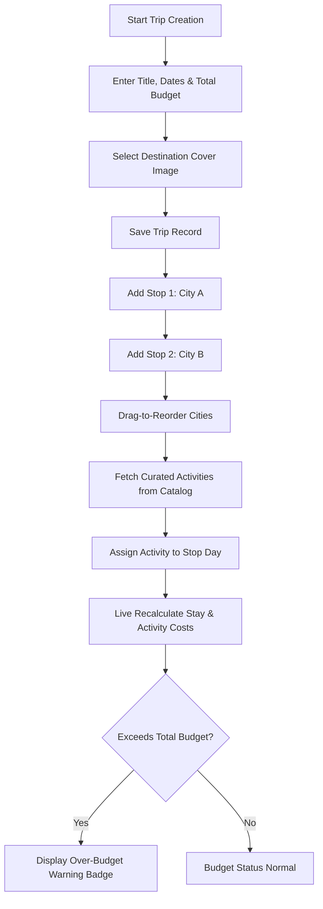
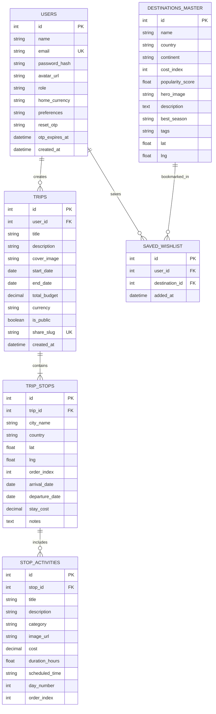

# 🌍 GlobeTrotter - Empowering Personalized Travel Planning

> **Odoo Hackathon Implementation & Architecture Blueprint**  
> GlobeTrotter is an end-to-end, multi-city travel planning platform designed to make trip design intuitive, collaborative, and visually captivating. Meeting and exceeding all 13 core requirements outlined in the Odoo Hackathon specification.

---

## 🌟 Hackathon Winning Pillars

### 1. 🎨 Visuals & UI Polish (Top Evaluation Criterion)
* **Design System**: Modern, clean travel UI with Tailwind CSS, Lucide icons, glassmorphism cards, vibrant destination banners, micro-animations (Framer Motion), dark/light mode toggle.
* **Interactive Map**: OpenStreetMap Leaflet integration with interactive city markers, animated travel route polyline connectors, and activity pins.
* **Dynamic Charts**: Chart.js / Recharts for budget breakdown (Doughnut chart by category: Stay, Transport, Food, Activities) and daily spending trend.
* **Draggable Timelines & Builders**: Drag-to-reorder itinerary stops, day-by-day scheduling, and expandable activity cards.

### 2. 🔐 Authentication, Validation & Security
* **Authentication**: JWT-based session auth, user registration, login, "Forgot Password" OTP flow via **Brevo Email API**, password strength meter, remember-me persistence.
* **Form Verification & Validation**: Strict input schema validation (email formatting, date logic [`end_date >= start_date`, stops within trip range], positive budget values, required fields) with inline error highlights.
* **Role-Based Access**: Traveler access vs Admin/Analytics dashboard.
* **Route Guards**: Protected routes (`/dashboard`, `/my-trips`, `/create-trip`, `/itinerary/:id`, `/profile`, `/admin`) with seamless redirect to `/login`.

### 3. 🗄️ Relational Database Architecture
Proper relational model with foreign keys, cascading deletes, and aggregate queries across `users`, `trips`, `trip_stops`, `stop_activities`, `destinations_master`, and `saved_wishlist`.

---

## 🗺️ System Flowcharts & User Journeys

### 1. End-to-End User Journey Flowchart


### 2. Authentication & Brevo OTP Flowchart


### 3. Multi-City Trip Building Logic


---

## 🗄️ Relational Database Schema (ERD)



---

## 📱 13 Specification Screens Mapping

| Screen # | Screen Name | Key Features & Visual Enhancements |
|---|---|---|
| **1** | **Login / Signup** | Split-screen visual, email/password validation, password strength indicator, remember me, Brevo OTP email modal. |
| **2** | **Dashboard / Home** | Personalized greeting with avatar, KPI summary cards (Total Trips, Countries Visited, Upcoming Trips), quick trip carousel, trending spots. |
| **3** | **Create Trip** | Multi-step form with Unsplash cover image selector, auto duration calculation, budget input validation (`end_date >= start_date`). |
| **4** | **My Trips** | Filter tabs (All, Upcoming, Ongoing, Completed), search bar, Grid/List view toggle, progress bar, quick actions (View, Edit, Duplicate, Share, Delete). |
| **5** | **Itinerary Builder** | Drag-to-reorder cities, city search autocomplete, automatic date allocation per stop, activity assignment per stop. |
| **6** | **Itinerary View** | Dual view toggle (Interactive Day-wise List & Leaflet Route Map), weather forecast widget, cost pills, PDF export trigger. |
| **7** | **City Search & Explore** | Global city discovery directory with search bar, continent filters, budget indicators ($, $$, $$$), popularity rating, quick "Add to Trip". |
| **8** | **Activity Search & Catalog** | Vibe filters (Sightseeing, Culinary, Adventure, Culture, Nightlife), duration filters, price tags, detailed drawer modal, instant assignment. |
| **9** | **Trip Budget & Cost Breakdown** | Category breakdown Doughnut chart, daily expenditure Bar chart, over-budget warning badges, currency switcher (USD, EUR, INR, GBP). |
| **10** | **Trip Calendar & Timeline** | Interactive calendar (Monthly/Weekly/Daily) and vertical timeline view showing activities scheduled at specific times. |
| **11** | **Shared / Public Itinerary** | Clean read-only presentation page accessible via public slug, interactive map, summary stats, "Fork / Copy Trip to My Account" CTA button. |
| **12** | **User Profile & Settings** | Editable details (name, email, avatar, bio), travel preferences checkboxes, home currency selector, saved wishlist destination cards. |
| **13** | **Admin / Analytics Dashboard** | Admin control center: Platform KPIs (Total Registered Users, Total Trips Created, Cumulative Budget), engagement charts, interactive user management table. |

---

## 🏗️ Repository Architecture

```
odoo-GlobeTrotter/
├── backend/                  # Node.js + Express + SQLite API
│   ├── src/
│   │   ├── config/           # Database setup & migrations
│   │   ├── controllers/      # Auth, Trips, Stops, Activities, Analytics controllers
│   │   ├── middleware/       # JWT Auth & validation middleware
│   │   ├── services/         # Brevo Transactional Email Service
│   │   ├── seed/             # Seed data (25+ destinations, 100+ activities)
│   │   └── server.js         # API entry point (port 5000)
│   ├── .env.example
│   └── package.json
│
├── frontend/                 # React 18 + Vite + TypeScript + Tailwind CSS
│   ├── src/
│   │   ├── components/       # Leaflet MapView, BudgetCharts, Navbar, Cards
│   │   ├── context/          # AuthContext, ThemeContext
│   │   ├── pages/            # All 13 specification screens
│   │   ├── services/         # API Client
│   │   ├── types/            # Relational TS types
│   │   └── App.tsx           # Route guards & router
│   ├── tailwind.config.js
│   └── package.json
├── FLOWCHART.md              # Detailed workflow diagrams
└── README.md                 # Project documentation
```

---

## 🚀 Setup & Execution Guide

### 1. Requirements
* **Node.js**: v18+
* **npm**: v9+

### 2. Quick Start (Single Command)
```bash
# Clone the repository
git clone https://github.com/Nirjala7-11/GlobeTrotter.git
cd GlobeTrotter

# Install all dependencies (Root, Backend, Frontend)
npm run install:all

# Start both Backend (Port 5000) & Frontend (Port 5173) concurrently
npm run dev
```

### 3. Environment Variables (`backend/.env`)
```env
PORT=5000
JWT_SECRET=globetrotter_secret_jwt_key_2026
BREVO_API_KEY=your_brevo_api_key_here
SENDER_EMAIL=noreply@globetrotter.com
SENDER_NAME=GlobeTrotter Travel
```

---

## 🛠️ API Reference Summary

| Method | Endpoint | Description | Auth Required |
|---|---|---|---|
| `POST` | `/api/auth/register` | Register new user & send Brevo welcome email | No |
| `POST` | `/api/auth/login` | User login & issue JWT | No |
| `POST` | `/api/auth/forgot-password` | Generate & send Brevo OTP email | No |
| `POST` | `/api/auth/verify-otp` | Verify 6-digit OTP code | No |
| `GET` | `/api/trips` | Get current user's trips | Yes |
| `POST` | `/api/trips` | Create new multi-city trip | Yes |
| `GET` | `/api/trips/share/:slug` | Get public shared itinerary | No |
| `POST` | `/api/trips/:id/duplicate` | Fork / Copy trip to user account | Yes |
| `GET` | `/api/destinations` | Get master destinations catalog | No |
| `GET` | `/api/admin/analytics` | Get platform KPIs & user management data | Admin |

---

## 📄 License
Licensed under the MIT License. Built with ❤️ for the Odoo Hackathon.
