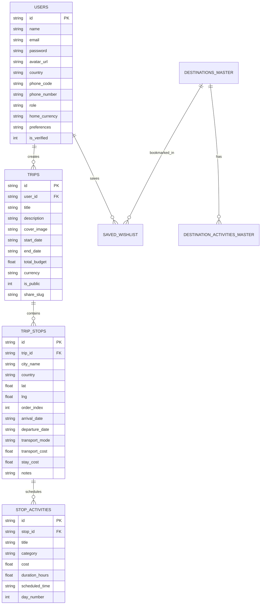

# 🌍 GlobeTrotter — Empowering Personalized Travel Planning

> **Built for the Odoo Hackathon 2026**  
> An intelligent, end-to-end multi-city travel planning platform combining interactive route mapping, automatic budget forecasting, day-by-day scheduling, Supabase Cloud / Relational database support, Brevo transactional email OTP, and collaborative itinerary sharing.

---

## 🌟 Highlights & Winning Features

- **🎨 Modern Luxury Travel UI**: Built with React 19, TypeScript, Tailwind CSS, Lucide icons, glassmorphism cards, and dark/light mode.
- **⚡ Supabase & Relational Backend Dual Architecture**:
  - **Supabase Cloud Ready**: Includes `@supabase/supabase-js` client and a complete PostgreSQL schema in `supabase/schema.sql` with Row-Level Security (RLS) policies, triggers, and Storage bucket support.
  - **Built-in Relational Backend**: Powered by SQLite with Foreign Keys, Cascades, and JWT session auth that works out-of-the-box offline or on local servers.
- **📱 Smart Country & Phone Code Auto-Binding**: On signup and profile editing, selecting a Home Country (India 🇮🇳, USA 🇺🇸, UK 🇬🇧, France 🇫🇷, Japan 🇯🇵, UAE 🇦🇪, etc.) automatically sets the matching international **dial code** (`+91`, `+1`, `+44`, `+33`, `+81`, `+971`, etc.) and default home currency!
- **📸 Profile Photo Selection**: Choose from curated high-res avatar presets or paste custom photo URLs on signup.
- **🗺️ Interactive Route Mapping**: OpenStreetMap Leaflet integration with custom pins, stop order badges, and animated route lines connecting multi-city stops.
- **📊 Real-Time Financial Analytics**: Interactive Chart.js Doughnut & Bar charts with category breakdowns (Transport, Lodging, Activities, Food, Misc) and over-budget threshold warnings.
- **🔐 Brevo Transactional Email Integration**: Secure email verification with 6-digit OTP codes and welcome emails powered by **Brevo (Sendinblue) API** with zero-config developer simulation fallback.
- **📋 Public Share & 1-Click Fork**: Shareable public URLs that allow fellow travelers to view, copy, or fork any itinerary into their personal account.
- **🛡️ Admin & Analytics Governance**: Dedicated administrator control panel with platform KPIs, top destination visit metrics, category spending distributions, and user management.

---

## 📱 13 Screens Feature Matrix (Full Hackathon Coverage)

| # | Screen Name | Key Functionality & Standout Additions |
|---|---|---|
| **1** | **Login / Signup Screen** | Split-screen travel design, profile photo picker, home country dropdown with auto-dial code binding (`+91`, `+1`, `+44`, etc.), password strength meter, JWT + Supabase + Brevo OTP flow, 1-click demo login. |
| **2** | **Dashboard / Home Screen** | Personalized greeting with user avatar, quick KPI cards (Trips, Destinations, Budget), prominent *"Plan New Trip"* CTA, recent trips stream, and trending global destinations. |
| **3** | **Create Trip Screen** | Step-by-step trip blueprint form: Title, start & end date picker with auto-calculated duration, budget input, currency selector, curated high-res cover photos, and live preview card. |
| **4** | **My Trips (List View)** | Filter tabs (*All, Upcoming, Ongoing, Completed*), search bar, Grid/List view toggle, summary cards with budget progress meters, actions (*View, Edit, Duplicate, Share, Delete*). |
| **5** | **Itinerary Builder Screen** | Interactive multi-city builder: "Add Stop" modal with city search autocomplete, date allocation per stop, drag/move up-down city reordering, transport mode selector (flight, train, bus, car), and activity assigner. |
| **6** | **Itinerary View Screen** | Comprehensive itinerary visualizer: Day-wise breakdown, city headers, activity blocks with time/cost/category badges, and dual view toggle (*Interactive Timeline vs Route Map*), plus Print/PDF export. |
| **7** | **City Search & Explore** | Global destination discovery directory: Filter by continent/region (*Europe, Asia, Americas, Africa, Oceania*), cost index (`$`, `$$`, `$$$`, `$$$$`), popularity rating, and direct "Add to Trip" action modal. |
| **8** | **Activity Search & Catalog** | Browse experiences by vibe (*Sightseeing, Food & Dining, Adventure, Culture, Nightlife, Relaxation*), max price filter, and modal preview with instant "Add to Stop" scheduling. |
| **9** | **Trip Budget & Cost Breakdown** | Financial dashboard: Budget vs Total Cost, **interactive Doughnut Chart** (Transport, Accommodation, Activities, Food, Misc) & daily spending **Bar Chart**, currency switcher, and over-budget alert banners. |
| **10** | **Trip Calendar & Timeline** | Interactive calendar view with day ribbons, expandable day views, and sequential activity timeline showing scheduled start times and durations. |
| **11** | **Shared / Public Itinerary** | Clean read-only presentation page accessible via public URL/slug, interactive route map, summary stats, **"Copy Trip to My Account"** feature, and one-click social share buttons (WhatsApp, Twitter/X, Copy Link). |
| **12** | **User Profile & Settings** | Editable user details (name, avatar, bio, home country, phone number, currency), travel style tags (*Solo, Luxury, Backpacking, Foodie, Nature*), saved wishlist destinations, and danger-zone account deletion. |
| **13** | **Admin / Analytics Dashboard** | Admin-only control center: Platform KPIs (Total Users, Trips Created, Total Budget), top destination visit rankings, category expenditure stats, and user governance table with role toggles. |

---

## 🔑 Demo Accounts (For Hackathon Judges)

| Role | Email | Password | Description |
|---|---|---|---|
| **Traveler (Default)** | `traveler.user@example.com` | `Traveler@123` | Full access to multi-city itineraries, budget analytics, and wishlist |
| **Administrator** | `admin@globetrotter.com` | `Admin@123` | Platform analytics, KPI telemetry, and user governance table |

> 💡 **Tip**: On the Login screen, click the **"👤 Traveler User"** or **"🛡️ Admin"** 1-click buttons to instantly populate credentials!

---

## ⚡ Supabase Setup (Optional Cloud Mode)

To connect GlobeTrotter to your live Supabase project:
1. Create a project at [supabase.com](https://supabase.com/).
2. Open the **SQL Editor** in your Supabase dashboard and run the entire script from **`supabase/schema.sql`**.
3. In `frontend/.env`:
   ```env
   VITE_SUPABASE_URL=https://your-project.supabase.co
   VITE_SUPABASE_ANON_KEY=your-supabase-anon-key
   ```
4. The application will automatically detect Supabase and synchronize Auth, Profiles, and Relational tables to Supabase Cloud!

---

## 🗄️ Relational Database Schema



---

## 🚀 Quick Start & Installation

### 1. Prerequisites
- Node.js (v18 or higher)
- npm (v9 or higher)

### 2. Clone the Repository
```bash
git clone https://github.com/Nirjala7-11/GlobeTrotter.git
cd GlobeTrotter
```

### 3. Setup & Start Backend Server
```bash
cd backend
npm install
node src/seed/seed.js   # Seeds 15 destinations, 50+ activities, and demo trips
npm start               # Runs backend on http://localhost:5000
```

### 4. Setup & Start Frontend Application
In a new terminal window:
```bash
cd frontend
npm install
npm run dev             # Runs frontend on http://localhost:5173
```

Open your browser and visit: **`http://localhost:5173`**

---

## 📄 License
Crafted with ❤️ for the **Odoo Hackathon 2026**. Licensed under the MIT License.
