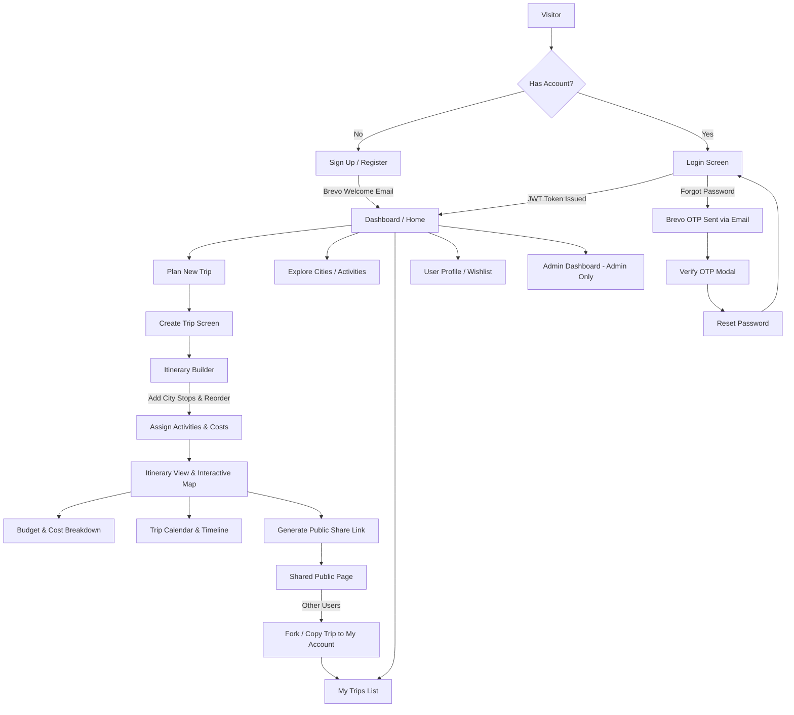
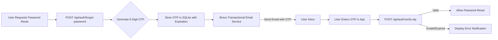
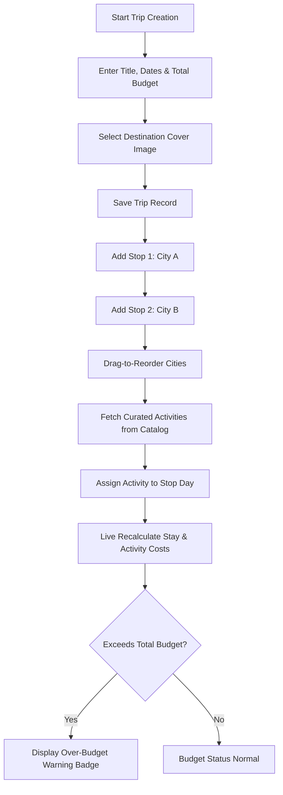
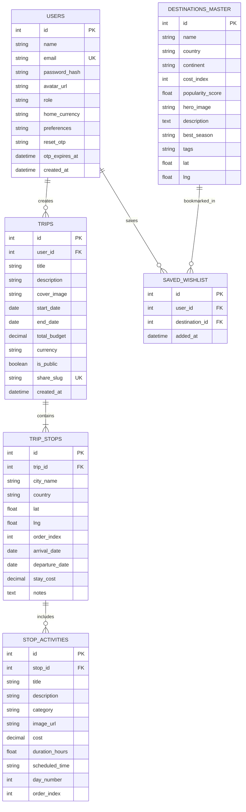

# GlobeTrotter - Multi-City Travel Planning Platform

GlobeTrotter is an end-to-end, multi-city travel planning application built for intuitive, collaborative, and structured trip management. The platform satisfies all core requirements specified in the Odoo Hackathon guidelines.

---

## Core Pillars & Features

### 1. Visual Design & User Interface
* **Design System**: Responsive travel interface utilizing Tailwind CSS, Lucide icons, glassmorphism containers, structured destination layouts, dark and light theme options, and smooth UI transitions.
* **Interactive Map**: Integration of Leaflet OpenStreetMap with custom city markers, dynamic route polyline connectors, and activity geographic points.
* **Data Visualization**: Chart.js integration for visual budget distribution (category breakdown via doughnut chart) and daily expense tracking.
* **Interactive Timelines**: Reorderable itinerary stops, structured day-by-day scheduling, and collapsible activity details.

### 2. Authentication, Input Validation & Security
* **Session & Identity Management**: JWT-based session state, registration, login, remember-me persistence, and a password reset workflow utilizing the Brevo Email API for transactional OTP generation.
* **Data Validation**: Client and server-side validation rules covering email syntax, date range integrity (end date must be greater than or equal to start date), positive budget amounts, and mandatory fields.
* **Access Control**: Role-based routing distinguishing standard travelers from administrative users.
* **Route Protection**: Protected navigation guards for user dashboards, trip management, itinerary creation, profile configuration, and administrative panels.

### 3. Relational Database Architecture
Structured relational storage using SQLite with primary/foreign key constraints, cascade operations, and aggregate queries across `users`, `trips`, `trip_stops`, `stop_activities`, `destinations_master`, and `saved_wishlist`.

---

## System Architecture & Data Flow

### 1. End-to-End User Flow


### 2. Password Reset OTP Flow


### 3. Multi-City Trip Building Logic


---

## Entity Relationship Diagram



---

## Application Screen Mapping

| Screen ID | Screen Name | Key Features |
|---|---|---|
| 1 | Login / Signup | Split-screen authentication layout, password validation meter, remember-me persistence, Brevo OTP email recovery modal. |
| 2 | Dashboard / Home | User greeting, overview key performance indicators, recent trip carousel, curated destination discovery. |
| 3 | Create Trip | Form setup, cover photo selection, duration computation, date and budget validation. |
| 4 | My Trips | Filter tabs (All, Upcoming, Ongoing, Completed), search input, grid/list view toggle, progress status, trip management actions. |
| 5 | Itinerary Builder | Drag-and-drop city reordering, location search autocomplete, date distribution, activity assignment. |
| 6 | Itinerary View | Toggleable day-wise schedule and interactive route map, weather preview widget, cost allocation tags, document export trigger. |
| 7 | City Search & Explore | Global destination directory, filter controls (region, budget level, popularity rating), quick trip addition actions. |
| 8 | Activity Catalog | Category filters (Sightseeing, Culinary, Adventure, Culture, Nightlife), duration filters, pricing data, activity drawer detail modal. |
| 9 | Budget Manager | Category breakdown doughnut chart, daily expense bar chart, budget threshold indicators, multi-currency support (USD, EUR, INR, GBP). |
| 10 | Calendar & Timeline | Interactive calendar (Monthly/Weekly/Daily) and structured time-slot itinerary breakdown. |
| 11 | Shared Itinerary | Read-only presentation screen for public URLs, interactive route map, statistics summary, trip cloning CTA. |
| 12 | User Profile & Settings | Account profile editing, travel preference options, default currency selection, saved wishlist collection. |
| 13 | Admin Analytics | Administrative overview metrics (Total Users, Total Trips, Platform Budget Aggregate), growth visualizations, user account administration table. |

---

## Project Structure

```
GlobeTrotter/
├── backend/                  # Express REST API Server
│   ├── src/
│   │   ├── config/           # Database configuration
│   │   ├── controllers/      # Route handler logic
│   │   ├── middleware/       # JWT and validation middleware
│   │   ├── services/         # Brevo email integration
│   │   ├── seed/             # Seed data initialization
│   │   └── server.js         # Backend entry point
│   ├── .env.example
│   └── package.json
│
├── frontend/                 # React 18 + Vite + TypeScript Application
│   ├── src/
│   │   ├── components/       # UI components (Map, Charts, Navigation)
│   │   ├── context/          # State management (Auth, Theme)
│   │   ├── pages/            # 13 Screen views
│   │   ├── services/         # HTTP API client
│   │   ├── types/            # TypeScript interfaces
│   │   └── App.tsx           # Application router and protected routes
│   ├── tailwind.config.js
│   └── package.json
├── FLOWCHART.md              # Workflow and architectural documentation
└── README.md                 # Technical project documentation
```

---

## Setup and Installation

### Prerequisites
* Node.js v18 or higher
* npm v9 or higher

### Installation
```bash
# Clone repository
git clone https://github.com/Nirjala7-11/GlobeTrotter.git
cd GlobeTrotter

# Install all dependencies across root, backend, and frontend
npm run install:all

# Launch backend and frontend development servers concurrently
npm run dev
```

### Environment Configuration
Copy `backend/.env.example` to `backend/.env` to configure local variables.

```
PORT=5000
JWT_SECRET=globetrotter_secret_jwt_key_2026
BREVO_API_KEY=your_brevo_api_key_here
SENDER_EMAIL=noreply@globetrotter.com
SENDER_NAME=GlobeTrotter Travel
```

---

## API Endpoint Overview

| Method | Endpoint | Functionality | Authentication |
|---|---|---|---|
| `POST` | `/api/auth/register` | User registration and transactional welcome email | Public |
| `POST` | `/api/auth/login` | Authentication and JWT issuance | Public |
| `POST` | `/api/auth/forgot-password` | Password recovery OTP email generation | Public |
| `POST` | `/api/auth/verify-otp` | OTP code verification | Public |
| `GET` | `/api/trips` | Retrieve current user trips | Required |
| `POST` | `/api/trips` | Create new multi-city trip record | Required |
| `GET` | `/api/trips/share/:slug` | Retrieve public shared itinerary | Public |
| `POST` | `/api/trips/:id/duplicate` | Clone existing trip into user account | Required |
| `GET` | `/api/destinations` | Retrieve master destination catalog | Public |
| `GET` | `/api/admin/analytics` | Retrieve administrative platform metrics | Admin Only |

---

## License
Distributed under the MIT License. Developed for the Odoo Hackathon.
