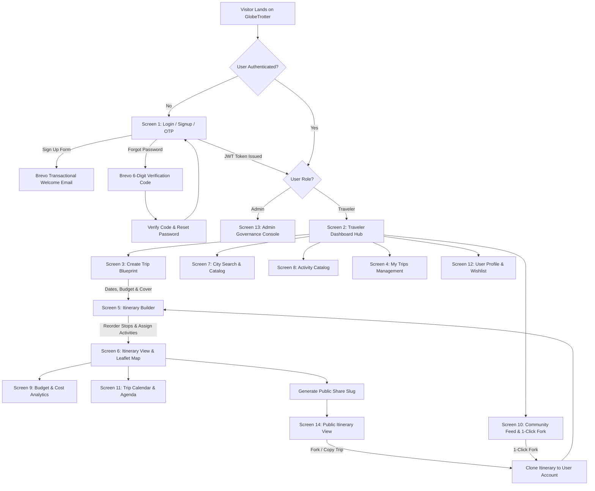
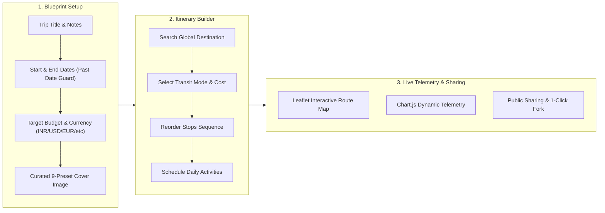
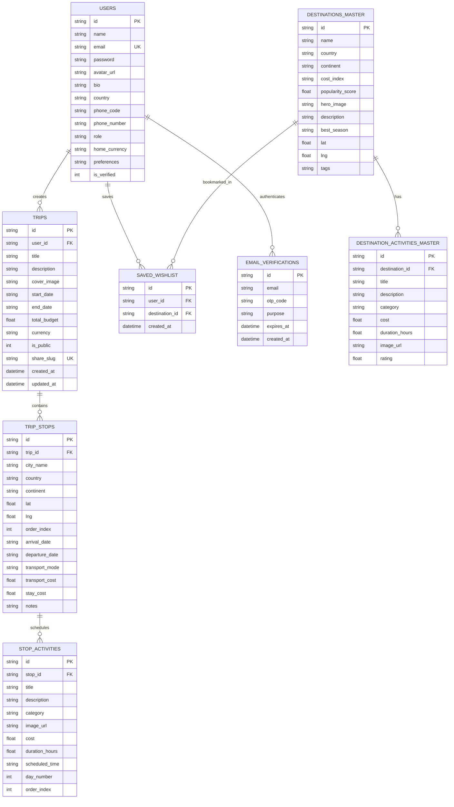
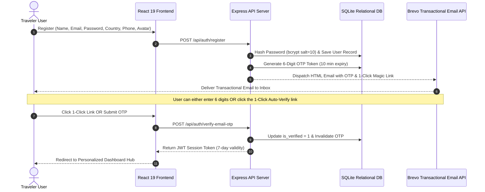

<div align="center">

# GlobeTrotter - Intelligent Multi-City Travel Planning Platform

### 🏆 Official Submission for the Odoo Hackathon 2026

*A production-grade, full-stack travel platform featuring a custom Node.js Express backend, relational SQLite database architecture with foreign keys and cascading integrity, interactive Leaflet route mapping, Chart.js real-time financial telemetry, dynamic multi-currency switching (`INR ₹`, `USD $`, `EUR €`, `GBP £`, `AED`, `JPY ¥`), day-by-day itinerary timeline scheduling, Brevo transactional verification emails with 1-click magic links, a community hub for forking public itineraries, and an administrator governance console.*

---

[](https://reactjs.org/)
[](https://www.typescriptlang.org/)
[](https://vitejs.dev/)
[](https://tailwindcss.com/)
[](https://nodejs.org/)
[](https://expressjs.com/)
[](https://www.sqlite.org/)
[](https://leafletjs.com/)
[](https://www.chartjs.org/)
[](https://www.brevo.com/)

</div>

---

## 📋 Table of Contents
1. [Demo Accounts & Quick Evaluation Credentials](#1-demo-accounts--quick-evaluation-credentials)
2. [Hackathon Problem Statement & Solution Highlights](#2-hackathon-problem-statement--solution-highlights)
3. [End-to-End System Architecture & User Flowcharts](#3-end-to-end-system-architecture--user-flowcharts)
4. [Relational Database Design & Entity Relationship Diagram (ERD)](#4-relational-database-design--entity-relationship-diagram-erd)
5. [Complete Application Screens Matrix](#5-complete-application-screens-matrix)
6. [Brevo Email & 1-Click Verification Security Architecture](#6-brevo-email--1-click-verification-security-architecture)
7. [Repository Structure & Clean Code Architecture](#7-repository-structure--clean-code-architecture)
8. [Installation & Local Startup Guide](#8-installation--local-startup-guide)
9. [REST API Endpoints Specification](#9-rest-api-endpoints-specification)

---

## 1. Demo Accounts & Quick Evaluation Credentials

For immediate testing, use the pre-configured verified accounts below:

| Account Type | Email Address | Password | Role & Default View | Key Features to Test |
|---|---|---|---|---|
| **Traveler (Default)** | `traveler.user@example.com` | `Traveler@123` | Traveler (`/dashboard`) | Multi-city builder, Leaflet route maps, dynamic currency switching, 1-click community fork, day calendar agenda |
| **Administrator** | `admin@globetrotter.com` | `Admin@123` | Admin (`/admin`) | Real-time platform KPI telemetry, category expenditure charts, user governance directory with instant role toggles |
| **New Traveler (Signup)** | Any valid email | Custom password | Traveler | Receives real Brevo transactional OTP email with a 1-Click auto-verification link |

---

## 2. Hackathon Problem Statement & Solution Highlights

| Core Hackathon Requirement | GlobeTrotter Implementation | Code Verification Link |
|---|---|---|
| **Multi-City Itinerary Planning** | Dynamic multi-destination builder with sequential stop reordering, date allocation, transport modes (flight, train, bus, car, boat), and curated activity assigner. | [`ItineraryBuilder.tsx`](frontend/src/pages/ItineraryBuilder.tsx) |
| **Relational Database Design** | 8 interrelated SQL tables with strict Foreign Key constraints, `ON DELETE CASCADE`, composite keys, and performance indexing. | [`schema.sql`](backend/schema.sql) & [`db.js`](backend/src/config/db.js) |
| **Dynamic Currency Switching** | Comprehensive support for **INR (₹)**, **USD ($)**, **EUR (€)**, **GBP (£)**, **AED**, and **JPY (¥)** across all inputs, budgets, telemetry charts, tables, and admin analytics. | [`formatters.ts`](frontend/src/utils/formatters.ts) |
| **Interactive Route Visualizer** | Multi-stop Leaflet map connecting destination coordinates with animated flight polylines, sequential pins, and popup activity summaries. | [`MapView.tsx`](frontend/src/components/MapView.tsx) |
| **Real-Time Financial Telemetry** | Real-time expense breakdown with Chart.js Doughnut (categories) and Bar (stops) charts + over-budget alert banner. | [`BudgetBreakdown.tsx`](frontend/src/pages/BudgetBreakdown.tsx) |
| **Community Itinerary Hub** | Explore public itineraries from global travelers with **1-Click Fork** to duplicate and customize any plan instantly. | [`CommunityFeed.tsx`](frontend/src/pages/CommunityFeed.tsx) |
| **Day-by-Day Agenda & Timeline** | Sequential calendar view with day ribbons and chronological activity timelines with time stamps and duration indicators. | [`TripCalendar.tsx`](frontend/src/pages/TripCalendar.tsx) |
| **Admin Governance Console** | Dedicated control center with platform KPIs, top destinations ranking, category spending metrics, and user management. | [`AdminDashboard.tsx`](frontend/src/pages/AdminDashboard.tsx) |
| **Brevo Transactional Verification** | Custom JWT auth + password hashing + Brevo transactional HTML email verification codes (10 min expiry) + 1-Click auto-verify link. | [`authController.js`](backend/src/controllers/authController.js) |

---

## 3. End-to-End System Architecture & User Flowcharts

### Platform Navigation and User Journey


---

### Multi-City Trip Builder Pipeline


---

## 4. Relational Database Design & Entity Relationship Diagram (ERD)

The complete SQL Data Definition Language (DDL) is located in **[`backend/schema.sql`](backend/schema.sql)** and initialized programmatically in **[`backend/src/config/db.js`](backend/src/config/db.js)**.



---

## 5. Complete Application Screens Matrix

| # | Screen Name | Route Path | Core Capabilities & UI Highlights |
|---|---|---|---|
| **1** | **Login / Signup / OTP** | `/login` | Vector cartoon avatars (DiceBear), country phone rules with hard `maxLength` capping, password strength meter, 6-digit OTP code, 1-Click auto email verification link. |
| **2** | **Dashboard / Home** | `/dashboard` | Traveler greeting, KPI telemetry cards (Trips, Destinations, Budget in home currency), "Plan New Trip" CTA, recent itineraries stream, and trending global destinations carousel. |
| **3** | **Create Trip Blueprint** | `/create-trip` | Step-by-step trip setup: Title, date validation with past-date guard (`min=today`), budget input with dynamic currency symbol prefix, 9 curated cover presets with active check indicators, and live preview card. |
| **4** | **My Trips (Management)** | `/my-trips` | Filter tabs (All, Upcoming, Ongoing, Completed), search bar, summary cards with budget progress meters formatted in trip currency, actions (View, Edit, Duplicate, Share, Delete). |
| **5** | **Itinerary Builder** | `/itinerary/:id/builder` | Multi-city stop builder: "Add Stop" modal with 20+ catalog destination autocomplete, stop reordering (up/down), transit mode selector (flight, train, bus, car, boat), and activity assigner with dynamic currency. |
| **6** | **Itinerary View** | `/itinerary/:id` | Day-wise breakdown, city headers, activity blocks with time/cost/category badges, dual view toggle (Timeline vs Leaflet Route Map), and Print/PDF export. |
| **7** | **City Search & Explore** | `/explore-cities` | Global destination directory: Filter by continent (Europe, Asia, Americas, Africa, Oceania), cost index ($, $$, $$$, $$$$), popularity rating, and direct "Add to Trip" modal. |
| **8** | **Activity Search & Catalog** | `/activities` | Experiences directory by category (Sightseeing, Food, Adventure, Culture, Nightlife, Relax), max price filter in user currency, and instant "Add to Stop" scheduling. |
| **9** | **Trip Budget & Analytics** | `/itinerary/:id/budget` | Financial dashboard: Budget vs Total Cost, interactive Chart.js Doughnut (categories) and Stacked Bar (stops) visualizers, dynamic currency labels, and over-budget alert banners. |
| **10** | **Community Hub & Feed** | `/community` | Explore public itineraries from travelers worldwide. Search by destination or creator, filter by travel style, and use **1-Click Fork** to duplicate any itinerary to your account. |
| **11** | **Trip Calendar & Agenda** | `/itinerary/:id/calendar` | Interactive calendar view with day ribbons, expandable day views, and sequential activity timeline showing scheduled start times and durations. |
| **12** | **User Profile & Settings** | `/profile` | Editable user details (name, avatar, bio, home country, phone number, currency), travel style tags, saved wishlist destinations, and danger-zone account deletion. |
| **13** | **Admin Governance Console** | `/admin` | Admin control center: Platform KPIs (Total Users, Trips Created, Total Budget in home currency), top destination rankings, category expenditure stats, and user governance table with role toggles. |
| **14** | **Public Shared Itinerary** | `/share/:slug` | Read-only presentation page accessible via public URL/slug, interactive route map, summary stats, "Copy Trip to My Account" feature, and one-click social share buttons. |

---

## 6. Brevo Email & 1-Click Verification Security Architecture



---

## 7. Repository Structure & Clean Code Architecture

```
GlobeTrotter/
├── backend/
│   ├── schema.sql                  # Pure SQL DDL schema & table design for judges
│   ├── src/
│   │   ├── config/
│   │   │   └── db.js               # SQLite database connection & table initializers
│   │   ├── controllers/
│   │   │   ├── adminController.js  # Platform telemetry & user governance
│   │   │   ├── authController.js   # JWT auth, registration, OTP verification, password reuse guard
│   │   │   ├── destinationsController.js # Cities & activity master catalog
│   │   │   └── tripController.js   # Multi-city itinerary CRUD, duplicate, & community feed
│   │   ├── middleware/
│   │   │   └── authMiddleware.js   # JWT token verification & role authorization
│   │   ├── seed/
│   │   │   ├── seed.js             # Automated database seeder
│   │   │   └── seedData.js         # 15 global cities, 50+ curated activities
│   │   ├── services/
│   │   │   └── brevoService.js     # Brevo REST API email dispatcher & templates
│   │   └── server.js               # Express application entrypoint
│   └── package.json
│
├── frontend/
│   ├── src/
│   │   ├── components/
│   │   │   ├── ActivityCard.tsx    # Curated activity card with add modal
│   │   │   ├── BudgetCharts.tsx    # Chart.js Doughnut & Stacked Bar visualizers
│   │   │   ├── CityCard.tsx        # Destination card with wishlist toggle
│   │   │   ├── Footer.tsx          # Responsive footer with platform links
│   │   │   ├── LoadingScreen.tsx   # Full-screen animated compass loader
│   │   │   ├── Logo.tsx            # Modern multi-ring vector brand logo
│   │   │   ├── MapView.tsx         # Interactive Leaflet polyline route map
│   │   │   ├── Navbar.tsx          # Glassmorphic navigation header with Community tab
│   │   │   └── TripCard.tsx        # Multi-city trip card with progress meters
│   │   ├── context/
│   │   │   ├── AuthContext.tsx     # Custom JWT authentication context
│   │   │   ├── ThemeContext.tsx    # Dark / Light theme state manager
│   │   │   └── ToastContext.tsx    # Modern toast notification provider
│   │   ├── pages/                  # 14 Application screens
│   │   ├── services/
│   │   │   └── api.ts              # Type-safe Fetch API client
│   │   ├── types/
│   │   │   └── index.ts            # TypeScript interfaces & domain models
│   │   └── utils/
│   │       ├── countries.ts        # Country code & dial code mapping with phone length rules
│   │       └── formatters.ts       # Centralized currency and date formatters
│   ├── index.html
│   ├── tailwind.config.js
│   ├── vite.config.ts
│   └── package.json
└── README.md
```

---

## 8. Installation & Local Startup Guide

### Prerequisites
- **Node.js**: v18.0.0 or higher
- **npm**: v9.0.0 or higher

### 1. Clone the Repository
```bash
git clone https://github.com/Nirjala7-11/GlobeTrotter.git
cd GlobeTrotter
```

### 2. Launch Backend API Server
```bash
cd backend
npm install
node src/seed/seed.js   # Seeds 15 global cities, 50+ master activities, & demo trips
npm start               # Runs Express backend on http://localhost:5000
```

### 3. Launch Frontend Application
In a second terminal:
```bash
cd frontend
npm install
npm run dev             # Runs Vite dev server on http://localhost:5173
```

Open your browser at: **`http://localhost:5173`**

---

## 9. REST API Endpoints Specification

| Method | Endpoint | Description | Auth Required |
|---|---|---|---|
| `POST` | `/api/auth/register` | Register new user with country, phone, cartoon avatar and trigger Brevo emails | No |
| `POST` | `/api/auth/verify-email-otp` | Verify 6-digit email OTP and activate account | No |
| `POST` | `/api/auth/login` | Authenticate user and receive JWT session token | No |
| `POST` | `/api/auth/forgot-password`| Request 6-digit password reset verification code | No |
| `POST` | `/api/auth/reset-password` | Reset password using verified 6-digit code (includes old password re-use check) | No |
| `GET` | `/api/auth/profile` | Get current authenticated user profile and stats | Yes (Bearer) |
| `PUT` | `/api/auth/profile` | Update profile, bio, country, phone, preferences | Yes (Bearer) |
| `GET` | `/api/trips` | Get all user trips with computed stops and costs | Yes (Bearer) |
| `GET` | `/api/trips/community/feed` | Get public community itineraries feed | No |
| `POST` | `/api/trips` | Create new multi-city trip blueprint | Yes (Bearer) |
| `GET` | `/api/trips/:id` | Get full trip detail with ordered stops and activities | Yes (Bearer) |
| `POST` | `/api/trips/:id/stops` | Add a destination stop to trip | Yes (Bearer) |
| `POST` | `/api/stops/reorder` | Reorder stops sequence | Yes (Bearer) |
| `POST` | `/api/stops/:stopId/activities` | Schedule an activity on a stop | Yes (Bearer) |
| `POST` | `/api/trips/:id/duplicate` | Duplicate / fork an existing trip | Yes (Bearer) |
| `GET` | `/api/trips/share/:slug` | Public read-only trip view by slug | No |
| `GET` | `/api/destinations` | Explore global destination catalog with filters | No |
| `POST` | `/api/wishlist/toggle` | Bookmark/unbookmark destination | Yes (Bearer) |
| `GET` | `/api/admin/analytics` | Admin KPI telemetry and category metrics | Yes (Admin) |
| `GET` | `/api/admin/users` | Admin user directory and role management | Yes (Admin) |

---

## 📜 License & Attribution
Designed and developed for the **Odoo Hackathon 2026**. Licensed under the [MIT License](LICENSE).
